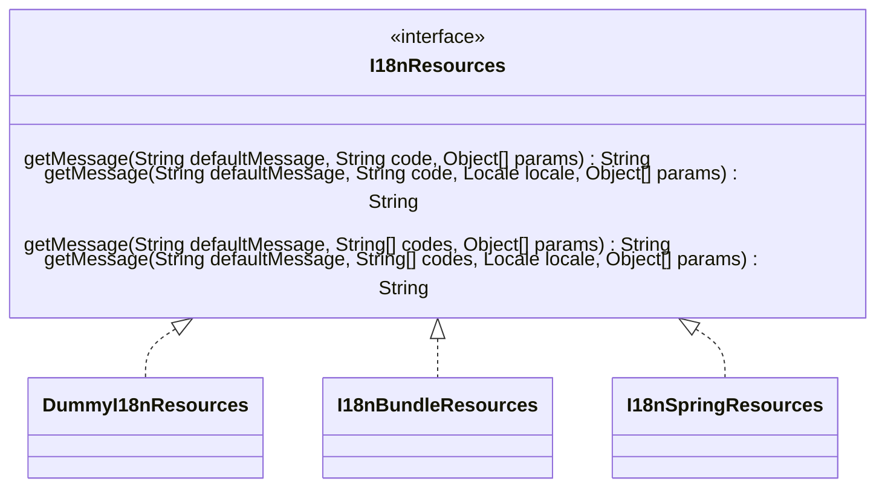

# I18N resources

Applications often contain one or many I18N resources with the localized texts
for the supported languages. This resources can be based in a wide variety of
technologies and APIs. Java JRE provides `ResourceBundle`,
Spring provides `MessageSource`, etc., for example.
The `I18nResources` interface provides a stable API for accessing I18N
resources without conditioning the choice of the underlying technology.

## Usage


```java
I18nResources resources = I18N.getResources();
I18nResources resources = I18N.getResources(namespace).
```

## Implementations

Three implementations are provided "out of the box":



### [DummyI18nResources](./apidocs/dev/orne/i18n/DummyI18nResources.html)

Dummy implementation that always returns the default text, using
`MessageFormat` for the formating of the resulting texts.

Is the default implementation returned by `I18N.getDefaultI18nResources()`
and `I18N.getResources()` if no resources has been
[configured](./configuration.html#i18nresources).
 
### [I18nBundleResources]()

Java `ResourceBundle` based implementation, using
`MessageFormat` for the formating of the resulting texts.

### [I18nSpringResources]()

Spring's `MessageSource` based implementation.
While `MessageFormat` is used for formatting default texts when no
localized text is found for the desired code(s) delegates in Spring for the
formating of the resulting texts.
