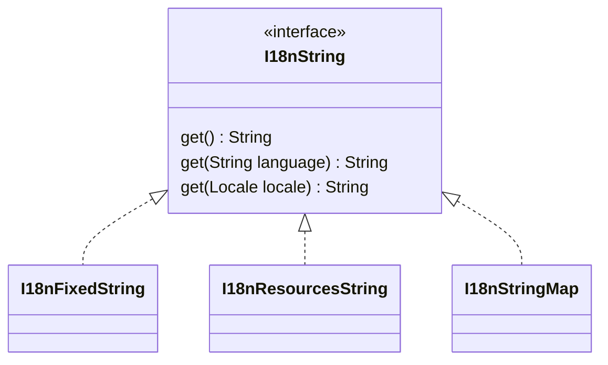

# I18N strings

The library provides classes for internationalized strings, compatibles with
Java Beans model. The core interface, `I18nString` provides methods to
obtain the string current user locale or in an specified locale.

Beans that contain potentially internationalized strings can use the interface
as property type:

```java
interface MyBean {
    I18nString getDescription();
}
class MyBeanImpl {
    private I18nString description;
    public I18nString getDescription() {
        return this.description;
    }
    public void setDescription(I18nString value) {
        this.description = value;
    }
}
```

The `I18nString` interface provides methods to retrieve the `String` values
for specific languages or for the I18N context's language:

```java
I18nString value ...;
value.get(); // Returns the text for current language
value.toString(); // Returns the default text
value.get(lang); // Returns the text for specified language
value.get(locale); // Returns the text for specified language
```

This allows defining data models and APIs that declare potentially
internationalized texts without exposing and/or conditioning the
implementation details.

## Implementations

Three implementations are provided "out of the box":



### I18nFixedString

Immutable implementation that contains a single shared string for all languages.
To be used when a I18N string is declared (in the API, for example) but it's
known that there is no I18N support for the value.

Use its factory method, `I18nFixedString.from(String)`
(or the shortcut `I18nString.fixed(String)`) to create new instances:

```java
I18nString description = I18nString.fixed("This text has no translation");
```

### I18nResourcesString

Immutable implementation based on the application's
[I18N resources](./i18n-resources.html) that lazily retrieves text for the
desired language.

Its factory method, `I18nResourcesString.forDefault(String)`
(or the shortcut `I18nString.fromResources(String)`),
returns a builder that, after calling `build()`, creates an immutable instance.

```java
I18nString description = I18nString.fromResources("Default text")
        .ofResources("my-alt-resources") // Optional, named I18N resources key
        .withCode("my.app.i18n.resource") // Required I18N resources code
        .withCode("my.app.i18n.alt.resource") // Optional, fallback I18N resources codes
        .withArg(my) // Optional, arguments to apply to resulting texts
        .build;
```

This implementation can be used, for example, to provide user friendly
enumeration constant names or descriptions:

```java
enum MyDiscreteType {
    ...
    CONSTANT_A("CONSTANT_A", "my.app.MyDiscreteType.CONSTANT_A"),
    ...
    ;
    private final I18nString description;
    private MyDiscreteType(String defaultDesc, String i18nCode) {
        this.description = I18nString.fromResources(defaultDesc)
            .withCode(i18nCode)
            .build();
    }
    public String getCode() {
        return this.name();
    }
    public I18nString getDescription() {
        return this.description;
    }
```

### I18nStringMap

Mutable map-based implementation. Can be used to provide the complete I18N
configuration of, for example, DB backed entities.

Its constructor, `I18nStringMap(String)`
(or the shortcut `I18nString.mapped(String)`), creates an instance that accepts
method chaining to set available translations:

```java
I18nString description = I18nString.mapped("Default text")
        .set(Locale.FRENCH, "French translation")
        .set("de", "German translation");
```

## Validation

Jakarta EE validation support is provided out of the box for the following
constraints:

- javax.validation.constraints.NotEmpty
- javax.validation.constraints.NotBlank
- javax.validation.constraints.Size
- javax.validation.constraints.Pattern

For all constraints, if the I18N string is a `I18nStringMap` both default text
and defined translations are validated.
Otherwise only the current language's translation (`I18nString.get()`) is
validated.

## Jackson support

Support is provided for I18N texts serialization and deserialization using
Jackson out-of-the-box.

By default the instances are serialized as a string with the translation
for current I18N context:

```java
class MyBean {
    private I18nString text;
    // Getter and setter
}

I18N.setLocale(Locale.FRENCH);
MyBean bean = new MyBean();

mapper.writeValueAsString(bean);
// { "text": null }

bean.setText(fixedI18nString);
mapper.writeValueAsString(bean);
// { "text": "Fixed text" }

bean.setText(resourcesI18nString);
mapper.writeValueAsString(bean);
// { "text": "French translation" }

bean.setText(mappedI18nString);
mapper.writeValueAsString(bean);
// { "text": "French translation" }
```

To serialize an instance as a JSON object with
all the available translations simply add the Jackson
`@JsonFormat(shape = JsonFormat.Shape.OBJECT)` annotation:

```java
class MyBean {
    @JsonFormat(shape = JsonFormat.Shape.OBJECT)
    private I18nString text;
    // Getter and setter
}

I18N.setLocale(Locale.FRENCH);
MyBean bean = new MyBean();

mapper.writeValueAsString(bean);
// { "text": null }

bean.setText(fixedI18nString);
mapper.writeValueAsString(bean);
// {
//   "text": {
//     "defaultText": "Fixed text",
//     "i18n": {}
// }

bean.setText(resourcesI18nString);
mapper.writeValueAsString(bean);
// {
//   "text": {
//     "defaultText": "Default text",
//     "i18n": {
//       "fr": "French translation"
//     }
// }

bean.setText(mappedI18nString);
mapper.writeValueAsString(bean);
// {
//   "text": {
//     "defaultText": "Default text",
//     "i18n": {
//       "fr": "French translation",
//       "de": "German translation",
//     }
// }
```

Note that when serialized as JSON objects fixed I18N strings provide an empty
`i18n` object and application resources based instances provide an `i18n`
object with a single translation for the current locale.
The later behavior is due to the fact that I18N resources don't expose the list
of available languages.

During deserialization a fixed I18N string is created for text JSON nodes and a
mapped I18N string for object JSON nodes:

```java
class MyBean {
    private I18nString text;
    // Getter and setter
}

MyBean bean = new MyBean();

// { "text": null }
assertNull(mapper.readValue(json, I18nString.class).getText());

// { "text": "Some text" }
assertEquals(
        I18nString.fixed("Some text"),
        mapper.readValue(json, I18nString.class).getText());

// {
//   "text": {
//     "defaultText": "Default text",
//     "i18n": {
//       "fr": "French translation",
//       "de": "German translation",
//     }
// }
assertEquals(
        I18nString.mapped("Default text")
            .set("fr", "French translation")
            .set("de", "German translation");),
        mapper.readValue(json, I18nString.class).getText());
```

JSON Schema with I18N types is provided at
[https://orne-dev.github.io/java-i18n/schema.json](./schema.json).

To define a I18n string property just add a reference to
`https://orne-dev.github.io/java-i18n/schema.json#string` in your JSON schema:

```json
{
    "$schema": "https://json-schema.org/draft/2020-12/schema",
    "$id": "https://example.com/schemas/bean",
    "type": "object",
    "properties": {
        "text": { "$ref": "https://orne-dev.github.io/java-i18n/schema.json#string" }
    }
}
```

## JAXB support

Support is provided for I18N texts serialization and deserialization using
JAXB out-of-the-box.

XML Schema with I18N types is provided at
[https://orne-dev.github.io/java-i18n/schema.xsd](./schema.xsd).

By default the instances are serialized as a string with the translation
for current I18N context:

```java
@XmlRootElement(namespace=MyBean.NS, name=MyBean.ROOT)
class MyBean {
    public static final String NS = "http://orne.dev/example";
    public static final String ROOT = "bean";
    public static final String TEXT = "text";
    @XmlElement(namespace=NS, name=TEXT)
    private I18nString text;
    // Getter and setter
}

I18N.setLocale(Locale.FRENCH);
MyBean bean = new MyBean();

marshaller.marshal(bean, out);
// <bean xmlns="http://orne.dev/example" xmlns:i18n="http://orne.dev/i18n/">
//   <text />
// </bean>

bean.setText(fixedI18nString);
marshaller.marshal(bean, out);
// <bean xmlns="http://orne.dev/example" xmlns:i18n="http://orne.dev/i18n/">
//   <text>Fixed text</text>
// </bean>

bean.setText(resourcesI18nString);
marshaller.marshal(bean, out);
// <bean xmlns="http://orne.dev/example" xmlns:i18n="http://orne.dev/i18n/">
//   <text>French translation</text>
// </bean>

bean.setText(mappedI18nString);
marshaller.marshal(bean, out);
// <bean xmlns="http://orne.dev/example" xmlns:i18n="http://orne.dev/i18n/">
//   <text>French translation</text>
// </bean>
```

To serialize an instance with nested elements with all the available
translations simply add the JAXB
`@XmlJavaTypeAdapter(I18nStringAdapter.Full.class)` annotation:

```java
@XmlRootElement(namespace=MyBean.NS, name=MyBean.ROOT)
class MyBean {
    public static final String NS = "http://orne.dev/example";
    public static final String ROOT = "bean";
    public static final String TEXT = "text";
    @XmlElement(namespace=NS, name=TEXT)
    @XmlJavaTypeAdapter(I18nStringAdapter.Full.class)
    private I18nString text;
    // Getter and setter
}

I18N.setLocale(Locale.FRENCH);
MyBean bean = new MyBean();

marshaller.marshal(bean, out);
// <bean xmlns="http://orne.dev/example" xmlns:i18n="http://orne.dev/i18n/">
//   <text />
// </bean>

bean.setText(fixedI18nString);
marshaller.marshal(bean, out);
// <bean xmlns="http://orne.dev/example" xmlns:i18n="http://orne.dev/i18n/">
//   <text>Fixed text</text>
// </bean>

bean.setText(resourcesI18nString);
marshaller.marshal(bean, out);
// <bean xmlns="http://orne.dev/example" xmlns:i18n="http://orne.dev/i18n/">
//   <text>
//     Default text
//     <i18n:translation lang="fr">French translation</i18n:translation>
//   </text>
// </bean>

bean.setText(mappedI18nString);
marshaller.marshal(bean, out);
// <bean xmlns="http://orne.dev/example" xmlns:i18n="http://orne.dev/i18n/">
//   <text>
//     Default text
//     <i18n:translation lang="fr">French translation</i18n:translation>
//     <i18n:translation lang="de">German translation</i18n:translation>
//   </text>
// </bean>
```

Note that when serialized with full translation fixed I18N strings provides no
translations and application resources based instances provide a single
translation for the current locale.
The later behavior is due to the fact that I18N resources don't expose the list
of available languages.

During deserialization a fixed I18N string is created for text nodes without
translations and a mapped I18N string for elements with nested translations:

```java
@XmlRootElement(namespace=MyBean.NS, name=MyBean.ROOT)
class MyBean {
    public static final String NS = "http://orne.dev/example";
    public static final String ROOT = "bean";
    public static final String TEXT = "text";
    @XmlElement(namespace=NS, name=TEXT)
    private I18nString text;
    // Getter and setter
}

MyBean bean = new MyBean();

// <bean xmlns="http://orne.dev/example" xmlns:i18n="http://orne.dev/i18n/">
//   <text />
// </bean>
assertNull(unmarshaller.unmarshal(reader).getText());

// <bean xmlns="http://orne.dev/example" xmlns:i18n="http://orne.dev/i18n/">
//   <text>Some text</text>
// </bean>
assertEquals(
        I18nString.fixed("Some text"),
        unmarshaller.unmarshal(reader).getText());

// <bean xmlns="http://orne.dev/example" xmlns:i18n="http://orne.dev/i18n/">
//   <text>
//     Default text
//     <i18n:translation lang="fr">French translation</i18n:translation>
//     <i18n:translation lang="de">German translation</i18n:translation>
//   </text>
// </bean>
assertEquals(
        I18nString.mapped("Default text")
            .set("fr", "French translation")
            .set("de", "German translation");),
        unmarshaller.unmarshal(reader).getText());

```

## Orne Tests Generators support

Generation of random values of `I18nString` values for testing using
[Orne Tests Generators][orne generators site] is supported out-of-the-box.
All the following will work as expected:

```java
Generators.randomValue(I18nString.class);
Generators.randomValue(I18nFixedString.class);
Generators.randomValue(I18nStringMap.class);
Generators.randomValue(I18nResourcesString.class);
```

All the generation parameters and parameters extraction available for string
generation are supported for the generation of default texts and translations.

```java
Generators.randomValue(
        I18nString.class,
        GenerationParameters.forSizes().withMinSize(5).withMaxSize(10));
```

[orne generators site]: https://orne-dev.github.io/java-generators/
